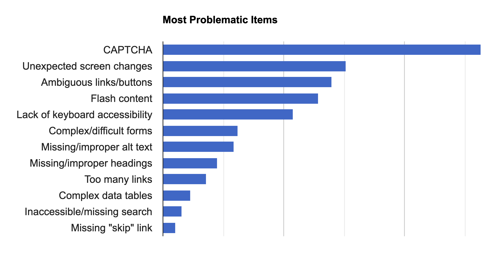
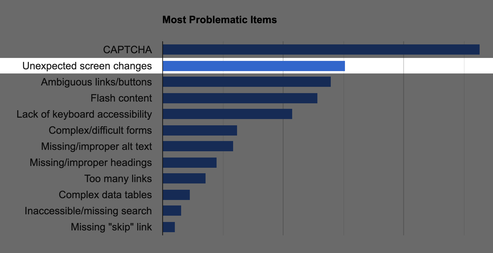

import { Appear, Notes, Image } from 'mdx-deck'
import { dark as darkTheme } from 'mdx-deck/themes'
import Syntax from './components/Syntax'
import theme from './theme'
import { Split } from 'mdx-deck/layouts'
import Hi from './components/Highlight'
import SVG from './components/SVG'
import AppearSplit from './components/AppearSplit'
import SplitCode from './components/SplitCode'
import FullsizeSandbox from './components/FullsizeSandbox'
import vsDark from "./surfTheme";
import { CodeSurferColumnLayout, Step, Code } from "code-surfer";

export const themes = [darkTheme, Syntax, vsDark, theme]

# Developing for <Hi>Accessibility</Hi>
*Common problems & how to fix them*

---

## What is accessibility?

---

<Appear>
  <h3>1. Capable of being <Hi>reached</Hi></h3>
  <h3>2. Capable of being <Hi>understood</Hi> or <Hi>appreciated</Hi></h3>
</Appear>

---

## Accessible websites are:

<Notes>So when we talk about websites being accessible, we really mean that they are navigable, and comprehendible.</Notes>

<Appear>
  <h1><Hi>Navigable</Hi></h1>
  <h1><Hi>Comprehendible</Hi></h1>
</Appear>

---

<Notes></Notes>

## Condition requiring assistive technologies:

<Appear>

# <Hi>Visual impairments</Hi>

# <Hi>Motor impairments</Hi>

# Auditory impairments

</Appear>

---

<Notes>According to the CDC</Notes>

According to the CDC

<Appear>

<h1><Hi>11%</Hi> of US adults are visually impaired in some way \*</h1>

\* _Does not include normal correctable vision problems_

<h1><Hi>36,000,000</Hi> people</h1>

</Appear>

---

<Notes>As best I could find in my research</Notes>

<h1><Hi>7% - 15%</Hi> of US adults live with a motor impairment \*</h1>

\* _This statistic was harder to pin down_

---

import California from './img/california.js'
import LeftHanded from './img/left-handed.js'

<AppearSplit
  left={<California width="30vw"/>}
  right={<LeftHanded width="30vw"/>}
/>

---

<Split>

### Braille Monitors

</Split>

---

<Split>

### Screen Readers

</Split>

---

<Split>

### Non-mouse/keyboard input devices

</Split>

---

## Why should we make the web accessible?

---

# It's the law

<Appear>

Covered by the <Hi>Americans with Disabilities Act (ADA)</Hi>

In <Hi>2017 alone</Hi> there were <Hi>817 lawsuits</Hi> over inaccessible websites

</Appear>

---

More importantly:

<Appear>

# It's the right thing to do

Gives <Hi>everyone</Hi> access to the services <Hi>they pay for</Hi> with their taxes

Helps make the web a less frustrating place for <Hi>everybody</Hi>

</Appear>

---

<Notes>Accessibility is a really big topic, but today I want to focus on two main aspects:</Notes>

<Appear>

<h1>1. <Hi>Screen reader support</Hi></h1>

<h1>2. <Hi>Keyboard navigation</Hi></h1>

</Appear>

---

## Rule \#1

<h1><Hi>Let the browser do its job</Hi></h1>

---

## HTML documents are accessible <Hi>by default</Hi>  

Websites usually become inaccessible  when we <Hi>override</Hi> the browser's default behavior.

---

# Common Problems

---

## Problem \#1

<h2><Hi>Overusing generic elements</Hi> (&lt;<Hi>div</Hi>&gt;, &lt;<Hi>span</Hi>&gt;, etc)</h2>

---

import StructureExample from './components/StructureExample'

<CodeSurferColumnLayout sizes={[1, 2]}>
  <Step>
    <StructureExample />
    <Code
      code={require("!!raw-loader!./code/structure.1.0.js").default}
      lang="html"
    />
  </Step>
  <Step>
    <StructureExample />
    <Code
      code={require("!!raw-loader!./code/structure.1.1.js").default}
      lang="html"
    />
  </Step>
  <Step>
    <StructureExample />
    <Code
      code={require("!!raw-loader!./code/structure.1.3.js").default}
      lang="html"
    />
  </Step>
  <Step>
    <StructureExample />
    <Code
      code={require("!!raw-loader!./code/structure.1.4.js").default}
      lang="html"
    />
  </Step>
  <Step>
    <StructureExample />
    <Code
      code={require("!!raw-loader!./code/structure.1.5.js").default}
      lang="html"
      focus="1:11"
    />
  </Step>
</CodeSurferColumnLayout>

---

<Notes>HTML Tags are used to signal the structure of the page to screen readers. They're also responsible for establishing a natural tab-order for keyboard users.</Notes>

### HTML tags have semantic meanings

# &lt;<Hi>header</Hi>&gt; &lt;<Hi>button</Hi>&gt; &lt;<Hi>footer</Hi>&gt; &lt;<Hi>form</Hi>&gt;

# &lt;<Hi>table</Hi>&gt; &lt;<Hi>a</Hi>&gt; &lt;<Hi>input</Hi>&gt; &lt;<Hi>nav</Hi>&gt;

---

Lesser-known semantic elements:

## &lt;<Hi>article</Hi>&gt; &lt;<Hi>blockquote</Hi>&gt; &lt;<Hi>progress</Hi>&gt; &lt;<Hi>dialog</Hi>&gt;

## &lt;<Hi>time</Hi>&gt; &lt;<Hi>output</Hi>&gt; &lt;<Hi>menu</Hi>&gt; &lt;<Hi>details</Hi>&gt; &lt;<Hi>meter</Hi>&gt;

---

## Problem \#2

<h2><Hi>Incorrectly associating elements</Hi></h2>

---

### Some HTML tags <Hi>require</Hi> relationships with other tags

# &lt;<Hi>label</Hi>&gt; &lt;<Hi>input</Hi>&gt;

---

import InputsExample from './components/InputsExample'

<CodeSurferColumnLayout sizes={[1, 2]}>
  <Step>
    <InputsExample />
    <Code
      code={require("!!raw-loader!./code/inputs.1.0.js").default}
      lang="html"
    />
  </Step>
  <Step>
    <InputsExample />
    <Code
      code={require("!!raw-loader!./code/inputs.1.1.js").default}
      lang="html"
    />
  </Step>
  <Step>
    <InputsExample />
    <Code
      code={require("!!raw-loader!./code/inputs.1.2.js").default}
      lang="html"
    />
  </Step>
  <Step>
    <InputsExample />
    <Code
      code={require("!!raw-loader!./code/inputs.1.2.js").default}
      lang="html"
      focus="1:19"
    />
  </Step>
</CodeSurferColumnLayout>

---

## Problem \#3

<h2>Attaching events to <Hi>non-interactive elements</Hi></h2>

---

import InteractiveExample from './components/InteractiveExample'

<CodeSurferColumnLayout sizes={[1, 2]}>
  <Step>
    <InteractiveExample />
    <Code
      code={require("!!raw-loader!./code/interactive.1.0.js").default}
      lang="jsx"
    />
  </Step>
  <Step>
    <InteractiveExample interactive />
    <Code
      code={require("!!raw-loader!./code/interactive.1.1.js").default}
      lang="jsx"
    />
  </Step>
</CodeSurferColumnLayout>

---

## Problem \#4

<h2><Hi></Hi></h2>

---

import LinksExample from './components/LinksExample'

<CodeSurferColumnLayout sizes={[1, 2]}>
  <Step>
    <LinksExample />
    <Code
      code={require("!!raw-loader!./code/links.1.0.js").default}
      lang="jsx"
    />
  </Step>
  <Step>
    <LinksExample />
    <Code
      code={require("!!raw-loader!./code/links.1.1.js").default}
      lang="jsx"
    />
  </Step>
</CodeSurferColumnLayout>

---

## Rule \#2

<h2>Pick HTML elements based on what they <Hi>mean</Hi>,  not based on how they <Hi>look</Hi></h2>

---

## I get it. <Hi>CSS is hard</Hi>

---

## Problem \#5

<h1>Updating the DOM  <Hi>without announcement</Hi></h1>

<!--  -->

---

---

---

<!-- <FullsizeSandbox>
  <iframe src="https://codesandbox.io/embed/ewxih?fontsize=22&hidenavigation=1" sandbox="allow-modals allow-forms allow-popups allow-scripts allow-same-origin"></iframe>
</FullsizeSandbox> -->

import FormExample from './components/FormExample'

<CodeSurferColumnLayout sizes={[1, 2]}>
  <Step>
    <FormExample />
    <Code
      code={require("!!raw-loader!./code/live.1.0.js").default}
      lang="jsx"
    />
  </Step>
  <Step>
    <FormExample />
    <Code
      code={require("!!raw-loader!./code/live.1.1.js").default}
      lang="jsx"
      focus="4:8,16"
    />
  </Step>
  <Step>
    <FormExample />
    <Code
      code={require("!!raw-loader!./code/live.1.2.js").default}
      lang="jsx"
      focus="16"
    />
  </Step>
  <Step>
    <FormExample />
    <Code
      code={require("!!raw-loader!./code/live.1.3.js").default}
      lang="jsx"
      focus="16:18"
    />
  </Step>
  <Step>
    <FormExample />
    <Code
      code={require("!!raw-loader!./code/live.1.4.js").default}
      lang="jsx"
      focus="13:19,21:26"
    />
  </Step>
  <Step>
    <FormExample />
    <Code
      code={require("!!raw-loader!./code/live.1.5.js").default}
      lang="jsx"
      focus="23"
    />
  </Step>
  <Step>
    <FormExample />
    <Code
      code={require("!!raw-loader!./code/live.1.5.js").default}
      lang="jsx"
      focus="1:30"
    />
  </Step>
</CodeSurferColumnLayout>

---
